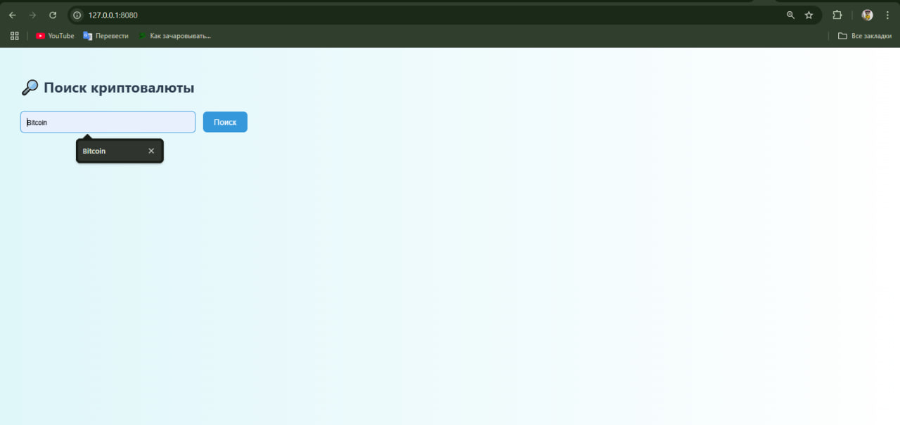
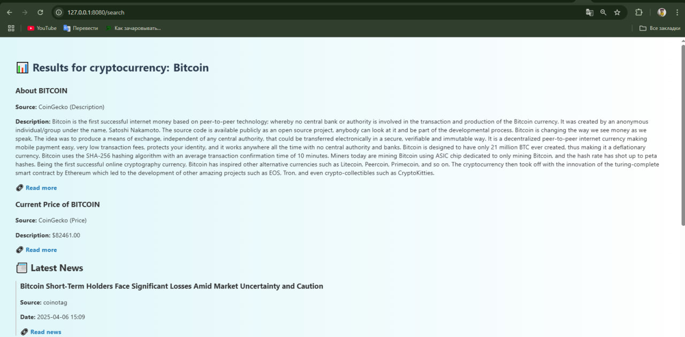
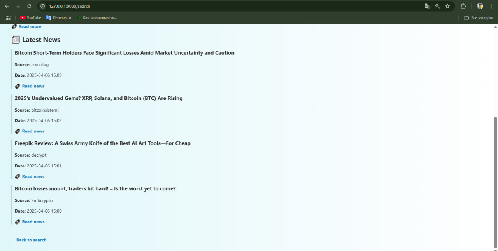

# Cryptocurrency News Aggregator in Rust

## 📌 Описание
Это Rust-приложение, которое позволяет пользователям получать описание и основную информацию о криптовалютах, введя название или символ криптовалюты. Данные получаются с CoinGecko API (бесплатно, без ключа).

## 🚀 Используемые технологии
- Язык: Rust (Actix-web, Reqwest, Serde)
- API: CoinGecko (без ключа)
- UI: HTML-интерфейс (форма поиска)
- Структура: модульная с папками `api/`, `handlers/`, `models/`, `utils/`

## 🧪 Как запустить
1. Установи [Rust](https://rustup.rs)
2. Клонируй репозиторий:
```bash
git clone https://github.com/your_username/cryptonews-aggregator.git
cd cryptonews-aggregator
```
3. Запусти:
```bash
cargo run
```

4. Открой в браузере:
- Главная страница: [http://127.0.0.1:8080/](http://127.0.0.1:8080/)
- Поиск крипты: `http://127.0.0.1:8080/news/bitcoin`

## 📷 Скриншоты

 


## 📂 Примеры

**GET** `/news/bitcoin`  
Ответ:
```json
[
  {
    "title": "About BITCOIN",
    "source": "CoinGecko",
    "date": "N/A",
    "summary": "...",
    "url": "https://bitcoin.org"
  }
]
```

## 📄 Лицензия
MIT License — см. [LICENSE](./LICENSE)

## 🧑‍💻 Автор
Nurasyl and Yershuak —  Blockchain Tech, 2025-04-04
